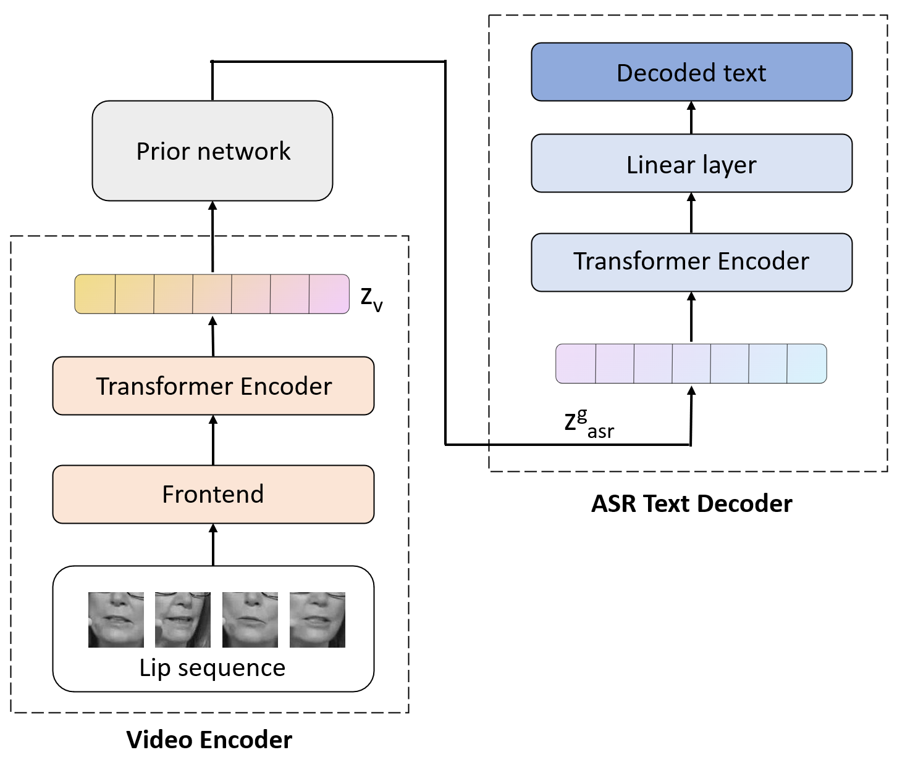

# **Lip2Vec: Efficient and Robust Visual Speech Recognition via Latent-to-Latent Visual to Audio Representation Mapping**

This repository contains a PyTorch implementation and pretrained models for **Lip2Vec**, a novel method for Visual Speech Recognition. For a deeper understanding of the method, refer to the paper 
[**Lip2Vec: Efficient and Robust Visual Speech Recognition via Latent-to-Latent Visual to Audio Representation Mapping**](https://openaccess.thecvf.com/content/ICCV2023/papers/Djilali_Lip2Vec_Efficient_and_Robust_Visual_Speech_Recognition_via_Latent-to-Latent_Visual_ICCV_2023_paper.pdf).


# Lip2Vec Inference:

The video representations computed by the video encoder are input to our learned prior network, which synthesizes them to audio representations. These representations are then passed through the encoder and linear layer of the Wav2vec2.0 model to predict the text. Note that audio representations are not used at test time.




## Pretrained models


| arch      | params | WER  | download |
|-----------|--------|------|----------|
| Lip2Vec-Base Low-Ressources | 43M   | 30.2 | [weights](https://drive.google.com/file/d/1NfTZgzGjjQVDFdIZsVwjqqgQHqeb194h/view?usp=drive_link) |
| Lip2Vec-Large Low-Ressources | 43M   | 42.6 | [weights](https://drive.google.com/file/d/132vaCJnLH9WCh1gO-9vNOQ-nLJIohQZ6/view?usp=drive_link) |

## Setup

### clone the repo:
```bash
git clone https://github.com/YasserdahouML/Lip2Vec.git
cd Lip2Vec
```
### Set up environment:
```bash
conda create -y -n lip2vec python=3.10
conda activate lip2vec
```

### clone av-hubert repo and install fairseq:
```bash
git clone https://github.com/facebookresearch/av_hubert.git
cd avhubert
git submodule init
git submodule update
cd fairseq
pip install --editable ./
```

### Install dependencies:
```bash
pip install -r requirements.txt
```
AV-HuBERT Large	LRS3 + VoxCeleb2 (En)	No finetuning
### Download AV-Hubert weights :
For downloading AV-HuBERT weights, use this [repo](https://facebookresearch.github.io/av_hubert/). Available weights:

- AV-HuBERT Large: LRS3 + VoxCeleb2 (En), No finetuning
- AV-HuBERT Base: LRS3 + VoxCeleb2 (En), No finetuning

## Inference on LRS3

Use the following command to perform inference on the LRS3 dataset. 

```bash
torchrun --nproc_per_node=4 main_test.py \
    --lrs3_path=[data_path] \
    --model_path=[prior_path] \
    --hub_path=[av-hubert_path] \

```
### arguments:
- data_path: Directory to the LRS3 test set videos
- prior_path: Path to the prior network checkpoint
- av-hubert_path: Path to the AV-Hubert weights

## Acknowledgement
The repository is based on [av-hubert](https://github.com/facebookresearch/av_hubert), [vsr](https://github.com/mpc001/Visual_Speech_Recognition_for_Multiple_Languages), [detr](https://github.com/facebookresearch/detr)

## Citation
```bash
@inproceedings{djilali2023lip2vec,
  title={Lip2Vec: Efficient and Robust Visual Speech Recognition via Latent-to-Latent Visual to Audio Representation Mapping},
  author={Djilali, Yasser Abdelaziz Dahou and Narayan, Sanath and Boussaid, Haithem and Almazrouei, Ebtessam and Debbah, Merouane},
  booktitle={Proceedings of the IEEE/CVF International Conference on Computer Vision},
  pages={13790--13801},
  year={2023}
}
```
